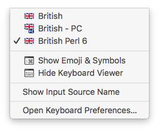
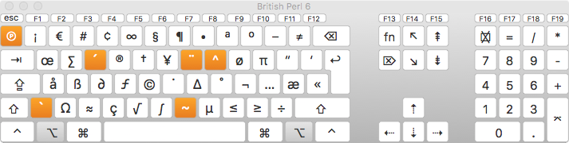
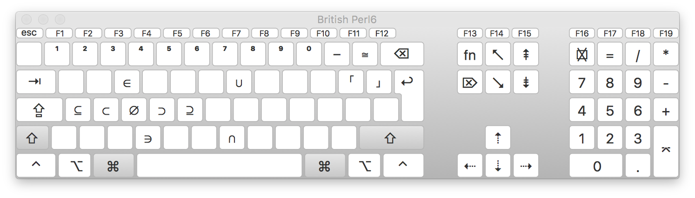
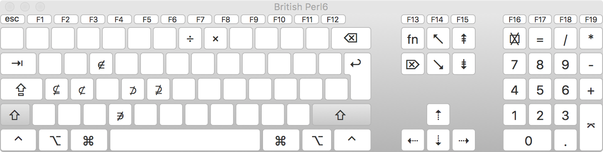
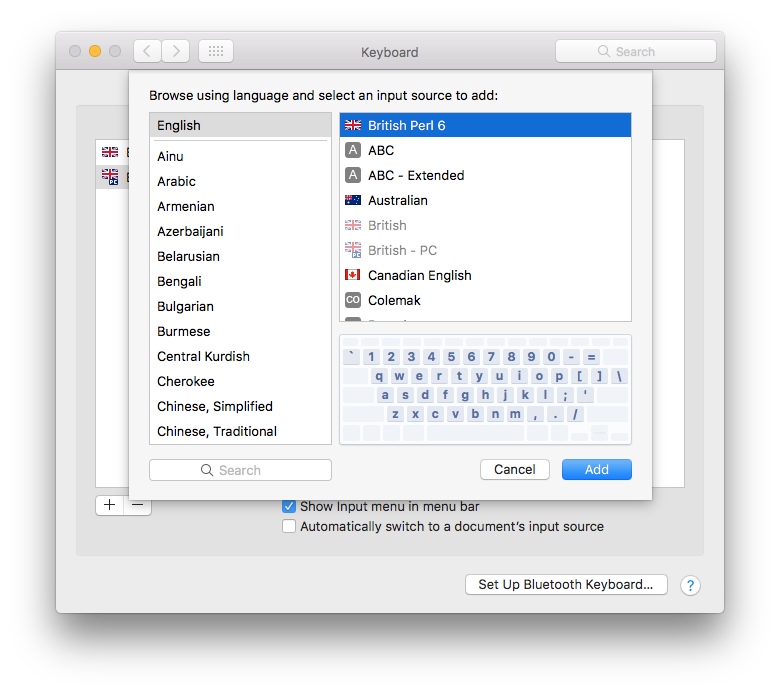

# Perl6-macOS-keyboard

Perl 6 has awesome Unicode support and I wanted easy access to more of the supported symbols so
I built a macOS keylayout for Perl 6. I am from the UK so this keylayout is based on the British
keylayout.

On the British keylayout the *Option-§* key (top left) is a dead key so I added a new keyboard state
that allows me to create definitions for pretty much all the keys.

The new *P6* keyboard state is selected by pressing *Option-§* which gives this layout:

Pressing *Shift* while in the *P6* keyboard state gives this additional layout:

## Installation

* Clone this repo
* Run `make install`
* Open *keyboard* preferences
* Add the *British Perl6* input source

## Design

Hopefully my key choices are reasonably intuitive:

* `0..9` are ⁰..⁹ - SUPERSCRIPT ZERO .. NINE
* `e` is ∈ - ELEMENT OF
* `c` is ∋ - CONTAINS AS MEMBER
* `u` is ∪ - UNION
* `n` is ∩ - INTERSECTION
* `s` is ⊂ - SUBSET OF
* `=` is ≅ - APPROXIMATELY EQUAL TO
* `[` is ｢ - HALFWIDTH LEFT CORNER BRACKET
* `]` is ｣ - HALFWIDTH RIGHT CORNER BRACKET

The remaining symbols were placed to be symmetrical with or adjacent to existing choices.

## Compatibility

This Perl 6 keylayout should work with all well-behaved macOS applications. I have tried it with
*Chrome*, *GNU Emacs (cocoa)* and *Terminal*.

## User Guide

The really nice thing is that the *Keyboard Viewer* serves as a really nice on-screen cheat
sheet.

## New Features

PRs or Issues are welcome.
